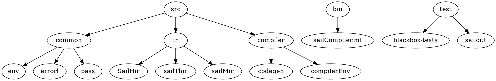

# SailOR : Technical Documentation

## General Structure



## Compilation process overview


```sequence
Parser -> Hir: syntax checking
Hir -> Thir: function call checks
Thir -> Mir: type-checking 
Mir -> Codegen: [...]
Codegen -> LLVM IR: error-free
LLVM IR -> LLVM IR : optimisation
LLVM IR -> binary : clang

```

```sequence
MIR -> ?1 : control-flow checks
?1 -> ?2 : borrow-checking + process to method
?2 -> Codegen : monomorphization
```


## Use of monads

## Error handling 

LoggerMonad

## Pass

Pass functor

## Env

## Tests

## Parsing

Parsing is done with Mehhir from the lexems given by ocamllex.
There are two parsing functions : a fast one with little info in case of an error and a slow one with better info. The fast one falls back to the slow
one when a syntax error is encountered for better error handling while maintaining fast parsing speed.
If parsing is successful, an AST of type `string * AstParser.statement SailModule` is created and passed on to HIR
Else, we check if there is an explicit message for the specific syntax error defined in *parserMessages.messages* and throw an error using the *Logger* monad.

## HIR
- Input : `string * AstParser.statement SailModule.t`
- Output : `loc AstHir.expression AstHir.statement SailModule.t`


Main objectives : de-sugarize the code, integrate token location into the AST type constructors

Details :
- Check if methods and processes exists
- Extract a method call from an expression into a statement
- Make sure no reactive statements or process call are contained inside a method

## THIR
- Input : `loc AstHir.expression AstHir.statement SailModule.t`
- Output : `(loc * sailtype) AstHir.expression AstHir.statement SailModule.t`
M
ain objective : add type to expressions

Details :
- Do type-checking on variables, structures, function parameters and return type
- Check for usage of undefined variables
- Make sure we only dereference actual references
- Simple out-of-bounds check for static arrays
- Check correct usage of lvalue / rvalue
- Infer type for type-less variable declaration & assignment


## MIR
- Input : `(loc * sailtype) AstHir.expression AstHir.statement SailModule.t`
- Output : `declaration list * cfg` where *declaration* is `{location : loc; mut : bool; id : string; varType : sailtype}` and *cfg* is a
set of blocks with an input and output representing control-flow information.

Main objective : construct a control-flow graph representation of THIR for use by the borrow-checker

Details :
- Eliminate 'If' / 'While' / 'Seq' or other control-flow constructs
- Add predecessors to each block
- Do some simple control-flow checks


## Codegen
- Input : `declaration list * cfg`
- Output : `llmodule`

Main objective : Translate the CFG representation of the program into LLVM Intermediate Representation. Any error at this point is considered
fatal.